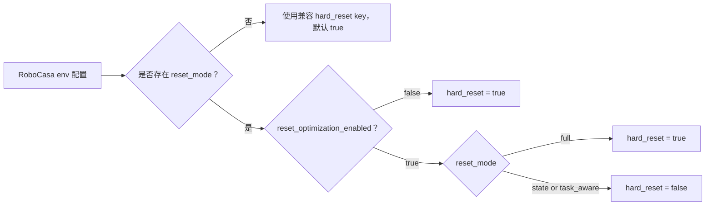

# Environment Reset Optimization

This note summarizes the LIBERO and RoboCasa reset latency optimizations used for embodied RL rollout.

## Goals

- Avoid rebuilding simulator assets when the task has not changed.
- Keep full reset available as the correctness fallback.
- Make the optimized path explicit through config, so default behavior remains conservative.

## Config Switches

### Global switch

```yaml
reset_optimization_enabled: true
```

Default: `false`.

When disabled, RLinf forces full reset behavior even if `reset_mode` is set. Enable this only for envs where the optimized reset semantics have been validated.

### Reset mode

```yaml
reset_mode: task_aware
```

Supported values:

- `full`: always use full reset semantics.
- `state`: require state reset; can fall back to full on mismatch depending on `reset_full_on_state_mismatch`.
- `task_aware`: use full reset when task/assets change, otherwise use optimized state reset.

Recommended training value: `task_aware`.

### LIBERO task-affine sampling

```yaml
reset_sampling_strategy: task_affine_fixed
```

Default: `random`.

With `task_affine_fixed`, each env/group is assigned a fixed task and reset samples only trials/init states from that task. This avoids frequent task switches from global random reset-state sampling.

## LIBERO Behavior

When optimization is enabled and `reset_mode: task_aware`:

- If task/BDDL changes, LIBERO performs full reset.
- If task/BDDL is unchanged, LIBERO uses soft reset plus `set_init_state`, avoiding MuJoCo sim/render-context reconstruction.

For multi-task LIBERO training, `task_affine_fixed` is important. Without it, global random reset-state sampling can switch tasks on most resets, forcing full reset and reducing the benefit of `task_aware`.

Example:

```yaml
env:
  train:
    reset_optimization_enabled: true
    reset_mode: task_aware
    reset_sampling_strategy: task_affine_fixed
```

Current `examples/embodiment/config/env/libero_spatial.yaml` includes:

```yaml
reset_optimization_enabled: true
reset_mode: task_aware
reset_sampling_strategy: task_affine_fixed
```

## RoboCasa Behavior

Current RLinf RoboCasa envs do not change task on reset. The task is assigned when the subprocess env is created.

When optimization is enabled:

```yaml
reset_optimization_enabled: true
reset_mode: task_aware
```

RoboCasa maps this to `hard_reset=False`, reusing simulator assets across resets.

Current `examples/embodiment/config/env/robocasa_closedrawer.yaml` includes this optimized mode.

## RoboCasa Reset 流程

RoboCasa reset 可以分成三层：

- RLinf wrapper 负责选择要 reset 的 env id，调用 subprocess vector env，
  把观测转换成 embodied policy 需要的格式，并清空 episode metrics。
- subprocess bridge 向每个被选中的子进程发送 `reset` 命令，调用底层
  robosuite/RoboCasa `env.reset()`，并补充 `ep_meta`，例如语言指令。
- robosuite/RoboCasa 负责真正的仿真 reset。最重的分支由 `hard_reset`
  控制：完整 reset 会重建 model 和 simulator；优化 reset 会保留它们，
  只重置 simulator state 和环境内部状态。

```mermaid
flowchart TD
    A["EnvWorker 触发 reset<br/>硬件：CPU，Ray EnvWorker 进程"] --> B["RobocasaEnv.reset(env_idx)<br/>硬件：CPU，主 Env 进程内存"]
    B --> C{"是否指定 env_idx？<br/>硬件：CPU"}
    C -- "否" --> D["reset 当前 EnvWorker 下全部 env<br/>硬件：CPU"]
    C -- "是" --> E["reset 指定 env id<br/>硬件：CPU"]
    D --> F["RobocasaSubprocEnv.reset(id=env_idx)<br/>硬件：CPU，进程间 Pipe"]
    E --> F
    F --> G["向选中的子进程发送 reset 命令<br/>硬件：CPU，IPC，OS 调度"]
    G --> H["子进程调用 robosuite/RoboCasa env.reset()<br/>硬件：CPU，Env subprocess，可受 CPU affinity 约束"]
    H --> I{"hard_reset？<br/>硬件：CPU"}

    I -- "true: full reset" --> J["销毁 viewer/sim（如已存在）<br/>硬件：CPU；涉及 offscreen renderer 时释放 GPU/EGL 上下文"]
    J --> K["Kitchen._load_model()<br/>采样 layout/style，构建 arena、fixtures、objects、robot pose<br/>硬件：CPU，内存，磁盘资产读取"]
    K --> L["MujocoEnv._initialize_sim()<br/>生成 XML，创建 MjSim，sim.forward，初始化时间<br/>硬件：CPU，内存"]

    I -- "false: optimized reset" --> M["sim.reset()<br/>复用 model、sim、renderer 和资产<br/>硬件：CPU，内存；不重建 GPU/EGL 上下文"]

    L --> N["Task/Kitchen _reset_internal()<br/>硬件：CPU，MuJoCo sim state"]
    M --> N
    N --> O["任务初始状态<br/>例如 CloseDrawer 设置抽屉为打开初始状态<br/>硬件：CPU，MuJoCo qpos/state"]
    O --> P["robosuite 内部状态<br/>renderer/context 引用、robot reset、controller reload、action dim reset<br/>硬件：CPU；offscreen context 需要 GPU/EGL"]
    P --> Q["Kitchen 状态<br/>设置 object qpos，并用零 action 跑 settling steps<br/>硬件：CPU，MuJoCo 物理步进"]
    Q --> R["sim.forward，重置 obs cache/observables，关闭默认可视化 site，update_state<br/>硬件：CPU"]
    R --> S["强制刷新观测并渲染相机图像<br/>硬件：GPU/EGL offscreen rendering，CPU 接收图像数组"]
    S --> T["子进程返回 raw obs 和 info.ep_meta<br/>硬件：CPU，IPC，内存拷贝"]
    T --> U["RLinf _wrap_obs()<br/>翻转图片，拼 25D state，提取 task_descriptions<br/>硬件：CPU，内存，CPU tensor"]
    U --> V["RLinf _reset_metrics()<br/>清空 reward、success/fail、return、elapsed steps<br/>硬件：CPU"]
    V --> W["返回 policy-format obs 和空 reset infos<br/>硬件：CPU；后续 policy 推理才进入模型 GPU"]
```



默认 `robocasa_closedrawer` 配置使用的仿真机器人是 `PandaOmron`；这是
MuJoCo 里的虚拟机器人，不是真实物理机器人。CPU 工作分布在 Ray
EnvWorker 进程和每个 RoboCasa env 对应的子进程中。刷新相机观测时会用
GPU/EGL 做 offscreen rendering。由于 RLinf 传给 robosuite 的
`render_gpu_device_id=-1`，实际 render GPU 由运行时环境变量推断，例如
`GPUS` 或 `CUDA_VISIBLE_DEVICES`。

当前 RoboCasa wrapper 的 `reset()` 不会向子环境传入 reset `options` 或新
seed。task assignment 和 env seed 在每个 subprocess env 创建时已经固定。
`update_reset_state_ids()` 是 no-op，因此 rollout 结束时的 bookkeeping 不会
改变下一次 RoboCasa reset 的目标任务。

### `hard_reset` mapping



`hard_reset=False` 仍然是真实的 episode reset。它会重置 MuJoCo state、
robot/controller state、任务 fixture state、object joint positions、
observation caches 和 episode metrics；它只跳过 model、XML、simulator
和 renderer reconstruction。

## Measured Results

### LIBERO

Direct benchmark, `libero_spatial`, 8 envs, 3 epochs, `settle_steps=1`:

| Mode | Mean Reset Time |
| --- | ---: |
| full | 7.07 s |
| task-aware optimized | 0.86 s |

Estimated saving: about 87.8%.

With default `settle_steps=15`, the optimized reset still helps, but settle time dominates more of the remaining latency.

### RoboCasa

Direct benchmark, `CloseDrawer`, 8 env seeds, 3 epochs:

| Mode | Mean Reset Time | p95 |
| --- | ---: | ---: |
| full (`hard_reset=True`) | 7.84 s | 10.53 s |
| task-aware optimized (`hard_reset=False`) | 0.60 s | 0.83 s |

Estimated saving: about 92.4%.

## Rollout-Level Impact

LIBERO spatial simulation, 8 envs, 64 rollout epochs:

| Sampling Strategy | Full Reset Ratio | State Reset Ratio |
| --- | ---: | ---: |
| global random reset-state sampling | 89.1% | 10.9% |
| `task_affine_fixed` | 0% | 100% |

This is why `task_affine_fixed` is recommended for multi-task LIBERO training when reset latency matters.

## Caveats

- `task_affine_fixed` fixes each env/group to a task. If the number of env groups is smaller than the number of tasks, not all tasks are covered at once.
- For full task coverage with fewer envs, add a future rotation strategy, for example rotating fixed task assignments every N rollout epochs.
- Evaluation configs should enable these options only when fixed-task sampling is intended.
- Cross-task state reset is not considered safe for LIBERO; task/BDDL mismatch must still use full reset.

## Quick Enablement

LIBERO training:

```yaml
env:
  train:
    reset_optimization_enabled: true
    reset_mode: task_aware
    reset_sampling_strategy: task_affine_fixed
```

RoboCasa training:

```yaml
env:
  train:
    reset_optimization_enabled: true
    reset_mode: task_aware
```
