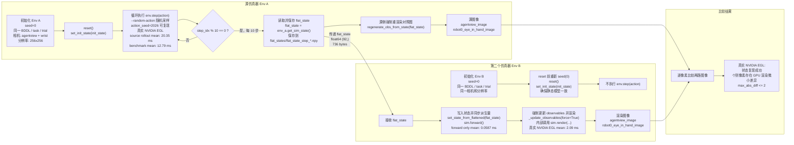

# LIBERO State Transfer Rendering Flowchart and Timings

Test setup unless otherwise noted:

- LIBERO suite: `libero_spatial`
- Task id / trial id / seed: `0 / 0 / 0`
- Task: `pick up the black bowl between the plate and the ramekin and place it on the plate`
- Cameras: `agentview`, `robot0_eye_in_hand`
- Resolution: `256x256`
- Source actions: seeded random actions, `action_seed=2026`
- Transfer interval: every 10 source `env.step(action)` calls
- State transfer payload: `flat_state = env.get_sim_state()`



## Data Sizes

| Data | Type / shape | Size | Transferred |
|---|---:|---:|---|
| `flat_state` array | `float64 (92,)` | `736 bytes` | Yes, every 10 steps |
| saved `flat_state_*.npy` file | NumPy `.npy` | `864 bytes` each | Saved every 10 steps |
| `agentview_image` | `uint8 (256, 256, 3)` | `196,608 bytes` | No, only for comparison |
| `robot0_eye_in_hand_image` | `uint8 (256, 256, 3)` | `196,608 bytes` | No, only for comparison |
| `body_pos` | `float64 (38, 3)` | `912 bytes` | No, if seed/reset sequence is identical |
| `body_quat` | `float64 (38, 4)` | `1,216 bytes` | No, if seed/reset sequence is identical |

## Timing Costs: Real NVIDIA EGL

This is the relevant non-sandbox result. The command was run outside the tool
sandbox so the Python process could access `/dev/nvidia*` and `/dev/dri/*`.
OpenGL reported:

| Field | Value |
|---|---|
| `GL_VENDOR` | `NVIDIA Corporation` |
| `GL_RENDERER` | `NVIDIA A800-SXM4-80GB/PCIe/SSE2` |
| `GL_VERSION` | `4.6.0 NVIDIA 580.65.06` |

Command environment:

```bash
MUJOCO_GL=egl
PYOPENGL_PLATFORM=egl
MUJOCO_EGL_DEVICE_ID=0
```

Output:

`/tmp/rlinf_libero_state_transfer_egl_real_gpu/libero_state_transfer_validation.json`

| Operation | Mean | Median | P95 | Notes |
|---|---:|---:|---:|---|
| Source rollout `env.step(action)` over 50 steps | `20.346 ms` | `19.877 ms` | `21.454 ms` | Includes normal source stepping and observation rendering; first step was slower at `37.0 ms` |
| Benchmark `env.step(action)` over 100 iters | `12.786 ms` | `12.679 ms` | `13.898 ms` | High-level LIBERO step with random action from a restored state |
| Env B `flat_state -> render` | `2.090 ms` | `2.094 ms` | `2.133 ms` | `set_state + sim.forward + _post_process + _update_observables(force=True) + _get_observations`; includes two camera renders |
| `env.sim.forward()` | `0.0587 ms` | `0.0584 ms` | `0.0596 ms` | State synchronization only; no physical time advance and no rendering |
| `env.sim.step()` | `0.0748 ms` | `0.0581 ms` | `0.0606 ms` | Raw MuJoCo step only; mean includes a small outlier |

Real GPU EGL speedups compared with sandbox llvmpipe EGL:

| Operation | Sandbox llvmpipe EGL | Real NVIDIA EGL | Speedup |
|---|---:|---:|---:|
| Env B `flat_state -> render` | `162.798 ms` | `2.090 ms` | `77.9x` |
| Benchmark `env.step(action)` | `179.559 ms` | `12.786 ms` | `14.0x` |
| Source rollout `env.step(action)` | `183.086 ms` | `20.346 ms` | `9.0x` |

Image comparison under real NVIDIA EGL:

| Camera | Equal syncs | Max abs diff | Mean abs diff notes |
|---|---:|---:|---|
| `agentview_image` | `3 / 5` | `1` | Differences only at tiny pixel-level scale |
| `robot0_eye_in_hand_image` | `4 / 5` | `2` | Differences only at tiny pixel-level scale |

The GPU result is not always bit-exact, but the differences are extremely small
and consistent with GPU rasterization/readback nondeterminism rather than state
transfer failure.

## Timing Costs: Sandbox Mesa llvmpipe

The same command run inside the tool sandbox used `MUJOCO_GL=egl`, but the
Python process could not see `/dev/nvidia*` or `/dev/dri/*`. OpenGL reported:

| Field | Value |
|---|---|
| `GL_VENDOR` | `Mesa` |
| `GL_RENDERER` | `llvmpipe (LLVM 15.0.7, 256 bits)` |
| `GL_VERSION` | `4.5 (Compatibility Profile) Mesa 23.2.1-1ubuntu3.1~22.04.3` |

This means sandbox EGL was CPU software rendering, not NVIDIA GPU rendering.

| Operation | Mean | Median | P95 | Notes |
|---|---:|---:|---:|---|
| Source rollout `env.step(action)` over 50 steps | `183.086 ms` | `183.081 ms` | `187.237 ms` | `/tmp/rlinf_libero_state_transfer_egl_retest` |
| Benchmark `env.step(action)` over 100 iters | `179.559 ms` | `178.796 ms` | `184.086 ms` | High-level LIBERO step |
| Env B `flat_state -> render` | `162.798 ms` | `163.912 ms` | `169.748 ms` | Includes two camera renders |
| `env.sim.forward()` | `0.0616 ms` | `0.0613 ms` | `0.0626 ms` | State synchronization only |
| `env.sim.step()` | `0.0618 ms` | `0.0617 ms` | `0.0623 ms` | Raw MuJoCo step only |

Sandbox OSMesa was also Mesa llvmpipe and therefore similar:

| Operation | Sandbox EGL llvmpipe | Sandbox OSMesa llvmpipe |
|---|---:|---:|
| Source rollout `env.step(action)` mean | `183.086 ms` | `182.521 ms` |
| Benchmark `env.step(action)` mean | `179.559 ms` | `178.413 ms` |
| Env B `flat_state -> render` mean | `162.798 ms` | `161.639 ms` |

## Backend Diagnosis

Why sandbox EGL and OSMesa were equally slow:

- `MUJOCO_GL=egl` selected `EGLGLContext`, but the renderer was still Mesa
  `llvmpipe`.
- `MUJOCO_GL=osmesa` selected `OSMesaGLContext`, also backed by Mesa
  `llvmpipe`.
- In the sandbox, `/dev/nvidia*` and `/dev/dri/*` were not visible to Python.
- Forcing NVIDIA EGL with
  `__EGL_VENDOR_LIBRARY_FILENAMES=/usr/share/glvnd/egl_vendor.d/10_nvidia.json`
  returned `eglQueryDevicesEXT() == 0` in the sandbox.
- Running the same check outside the sandbox exposed `/dev/nvidia0..7` and
  `/dev/dri/renderD128..135`, and EGL reported `NVIDIA A800-SXM4-80GB`.

## Interpretation

The main cost is rendering observation images, not MuJoCo state synchronization
or raw physics stepping:

- `sim.forward()` is about `0.06 ms`.
- Raw `sim.step()` is also about `0.06 ms` median.
- Software llvmpipe rendering makes two 256x256 cameras cost about `163 ms`.
- Real NVIDIA EGL makes the same two-camera rerender cost about `2.1 ms`.

## Conclusion

With the same BDDL, trial, camera configuration, resolution, and reset random
sequence, Env A only needs to send `flat_state` to Env B. The transferred data is
`736 bytes` per synchronization, and Env B can rerender the corresponding images
without running `env.step(action)`.

In the true NVIDIA EGL environment, Env B needs about `2.09 ms` to generate the
two 256x256 camera images from `flat_state`. In the sandbox llvmpipe environment,
the same operation takes about `163 ms`, which is why EGL and OSMesa looked
similar before GPU device access was enabled.
